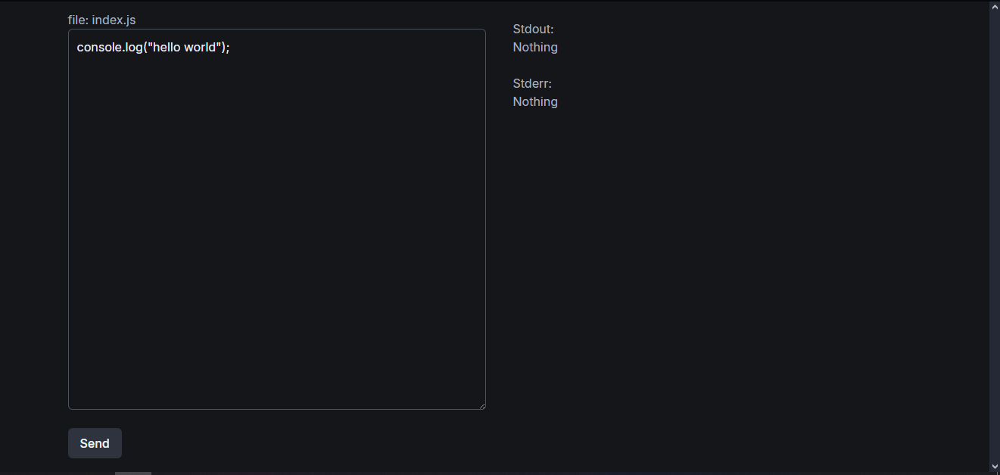
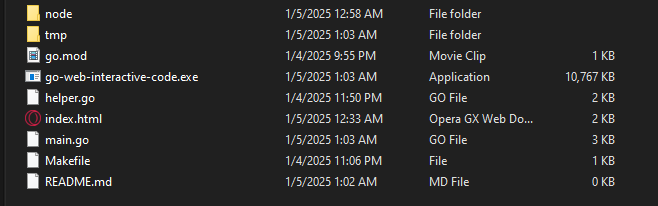
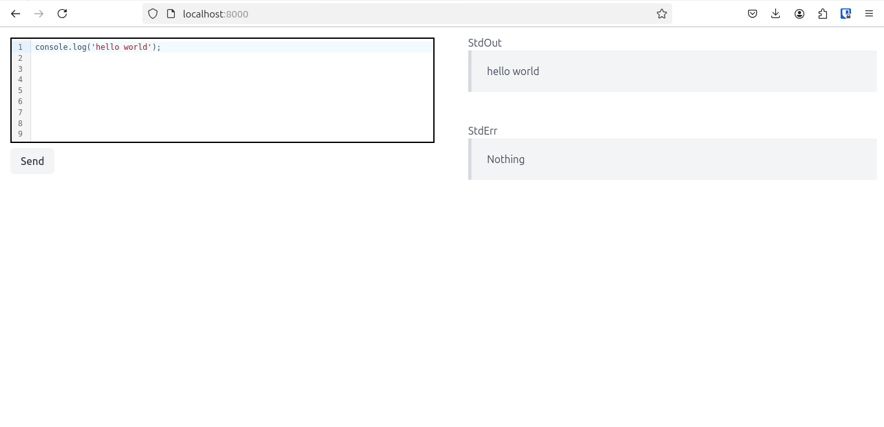

Sama seperti ada di CodeWars,LeetCode,dll

# CODE INTERACTIVE WEB

### Kebutuhan

- Install NodeJS terbaru
- Install Golang terbaru
- Install CMAKE

### Development

- Masuk root folder
- Menjalankan Golang `make run/api`
- Menjalankan Web `make run/web`

### Preview Setelah Build

- Menjalankan di linux: `make run/preview_linux`
- Menjalankan di windows: `not testing`

### Production

- buat file `.env.prod` di golang dan file `.env.production` di web
- Menjalankan `make build && make deploy/tar && make deploy`

### Kendala

- PATH NodeJS executable di windows dan linux ketika production
- Atur path di urutan nomor 65 di file `main.go`. global: `node`. relative: `path node.exe`.
- Atur Cors di bagian file `main.go` dan atur port di bagian file `.env` folder web

### Todo

- [x] Buat flag parse di `main.go`
- [x] Embed file html dan folder dist di file `main.go`
- [x] File Docker dan Masukin Web

