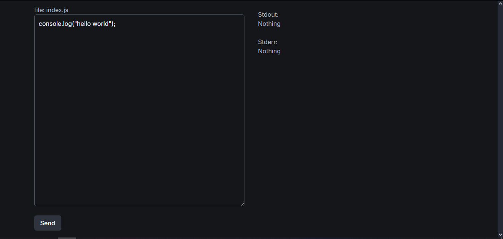
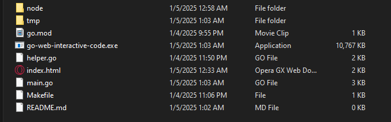

Sama seperti ada di CodeWars,LeetCode,dll

# CODE INTERACTIVE WEB

### Kebutuhan

- Install NodeJS terbaru
- Install Golang terbaru

### Development

- Menjalankan `go run .` atau `go run *.go`

### Production

- Menjalankan `go build`

### Kendala

- PATH NodeJS executable di windows ketika production
- Atur path di urutan nomor 65 di file `main.go`. global: `node`. relative: `path node.exe`.

