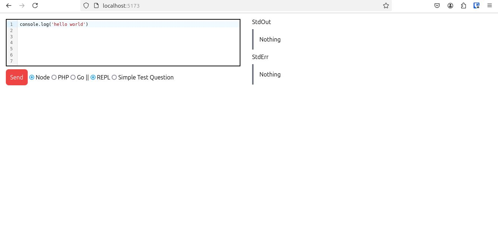

# Go Web Code Interactive

An interactive code execution platform that allows users to write, execute, and test code in multiple programming languages directly in the browser. Similar to platforms like CodeWars and LeetCode, this application provides a real-time coding environment with built-in security and rate limiting.

## 🚀 Features

- **Multi-language Support**: Execute code in Node.js (JavaScript), PHP, and Go
- **Interactive Editor**: Real-time code editor with syntax highlighting using CodeMirror
- **Security Validation**: Built-in protection against dangerous operations and system access
- **Rate Limiting**: Protection against abuse with IP-based rate limiting (10 requests/minute)
- **Responsive UI**: Mobile and desktop-friendly interface
- **Docker Support**: Easy deployment with pre-configured Docker images
- **Static Embedding**: Frontend assets embedded directly in the Go binary

## 🛠️ Tech Stack

- **Backend**: Go 1.23+ with embedded file system
- **Frontend**: Svelte 5 (with runes), TypeScript, Tailwind CSS
- **Code Editor**: CodeMirror 6 with language-specific syntax support
- **Build Tools**: Make, UPX binary compression, Docker
- **Languages Supported**: JavaScript (Node.js), PHP, Go

## 🔧 Prerequisites

Before running the application, install the following:

- Go 1.23+ (latest version recommended)
- Node.js (latest version recommended)
- PHP 8.1+
- CMAKE
- UPX (for binary compression)
- Docker (for containerized deployment)

## 📦 Installation & Setup

### Development Environment

1. Clone the repository
2. Navigate to the project root directory
3. Install backend dependencies:
   ```bash
   go mod tidy
   ```
4. Install frontend dependencies:
   ```bash
   cd web/
   npm install
   cd ..
   ```

### Running in Development Mode

- **Backend API**: `make run/api`
- **Frontend Web**: `make run/web`

### Managing Frontend Dependencies

Use the provided make commands to manage Node.js packages:
- Install single package: `make npmi i=package_name`
- Install multiple packages: `make npmi i="pkg1 pkg2"`
- Install all packages: `make npmi i=""`
- Uninstall package: `make npmu u=package_name`

## 🚨 Security Features

The application implements multiple security layers:

1. **Code Validation**: Regex-based pattern matching to block dangerous operations:
   - File system access (fs, os modules in Node.js)
   - Network operations (http, net modules)
   - System commands (exec, shell commands in PHP)
   - Unsafe imports in Go

2. **Sandboxing**: Code executes in isolated temporary files

3. **Rate Limiting**: Maximum 10 requests per minute per IP address

4. **Language Restrictions**: Only supports safe subset of operations in each language

## 📝 Execution Modes

The application supports two execution modes:

- **REPL Mode**: Execute arbitrary code and view output
- **Simple Test Question (STQ)**: Execute code with predefined templates for standardized testing

## 🛠️ Build Process

### Local Development Build

- Clean build: `make build` (creates binaries for Linux and Windows)
- Linux preview: `make run/preview_linux`
- Web-only build: `make build/web`
- Cross-platform build: `make build_alpine` (for Alpine Linux)

### Production Deployment

1. Create `.env.prod` for backend and `.env.production` for frontend
2. Configure CORS and server port settings
3. Build and deploy with:
   - Ubuntu: `make deploy/prod`
   - Alpine: `make deploy/prod_alpine`

## 🐳 Docker Deployment

The application includes multiple Docker configurations:
- `Dockerfile`: Standard Ubuntu-based image
- `Dockerfile-alpine`: Lightweight Alpine-based image

Both images include all necessary runtimes (Node.js, PHP, Go) for code execution.

## 🌐 Environment Configuration

The application supports multiple runtime modes:
- **Development**: Uses `.env.local`
- **Preview**: Uses `.env.preview` with `-mode preview` flag
- **Production**: Uses `.env.prod` with `-mode prod` flag

Configure CORS domains and application ports in the respective environment files.

## 🧪 Testing

Run the complete test suite with:
```bash
go test ./...
```

The test suite covers:
- HTTP handlers
- Security validation
- Utility functions
- Rate limiting functionality

## 🚀 API Endpoints

- `GET /`: Serves the frontend application
- `POST /`: Executes user code with validated input
- `OPTIONS /`: Pre-flight requests for CORS

## 📊 Code Validation

The security validator checks for potentially dangerous patterns in user code:
- **JavaScript**: Blocked modules (fs, child_process, os, net, http), eval, process, global
- **PHP**: System commands (exec, shell_exec, system, passthru), file operations, superglobals
- **Go**: Unsafe imports (os, os/exec, net, syscall, unsafe), file operations, system calls

## 🤝 Contributing

1. Fork the repository
2. Create a feature branch
3. Make your changes
4. Add tests if applicable
5. Submit a pull request

## 📄 License

This project is open source and available under the MIT License.

## 🐛 Known Issues

- Windows production PATH configuration for Node.js executables
- CORS configuration requires manual adjustment in `main.go`

## 📋 Todo

- [x] Command-line flag parsing in `main.go`
- [x] Embed frontend HTML and dist folder in Go binary
- [x] Docker configuration with embedded web assets
- [x] Request/response logging
- [x] Responsive UI for mobile and desktop
- [x] Advanced code editor with VS Code-like features



